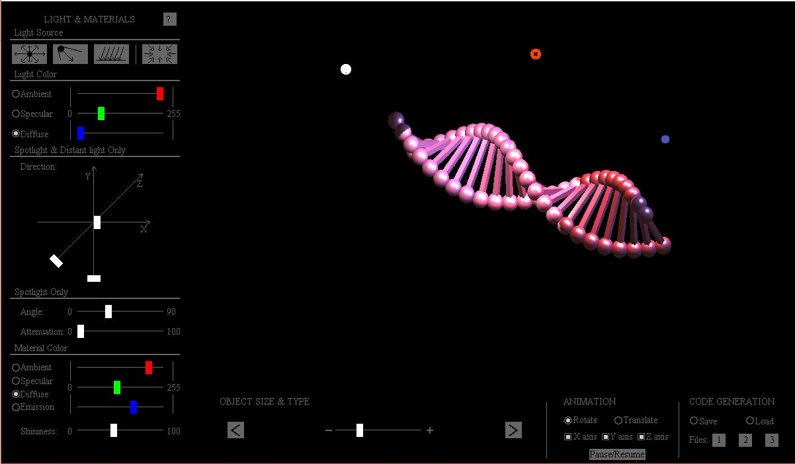

# OpenGL-LightingStudio
A c/c++ mixed program. A practice of lighting in OpenGL library. It is a GUI-based interactive system that set lighting and material properties to create a 3D scene being colored and looks realistic.

Windows users can run the .exe file to open the studio user interface. Like the screenshot below.

It was my undergraduate final year project. I was only a novice of C and all programming methods I knew were related to OpenGL library. So the UI is all implemented using 3D objects from OpenGL library. 
### Main functionality
- Add new light sources to the scene
    - Four types: Spotlight, point light source, parallel light, global ambient light
    - Modify the diffuse, specular, and ambient color of the light
    - Drag the point light source and spotlight all around the scene
- Change model
    - Change the diffuse, specular, and ambient properties of the matrial
- Simple Animation
    - Rotation
    - Translation
- Save the setting
    - to a local txt file and reload it next time.
